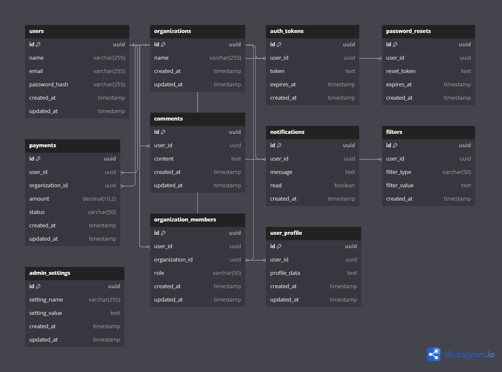

# Project Name - Database Schema and API Documentation for HNG Boilerplate NodeJS by team egen

This document outlines the database schema and API endpoints for the **HNG Boilerplate NodeJS** project, detailing tables, relationships, and API endpoints.

## link for the documentation of our API on swagger editor
[link to API design](https://editor.swagger.io/?url=https://gist.githubusercontent.com/AMdabour/43d495f7ef90ddd0bb3be5a1c49805ab/raw/89a2706bcf2e449cc30d1c792009581d825db20d/openapi.json)

## link for database design
[link to db design](https://dbdiagram.io/d/HNG-Boilerplate-NodeJS-DB-design-6692400b9939893daed32e00)

# HNG Boilerplate NodeJS by team egen

This API provides endpoints for managing organizations, users, payments, admin operations, and comments.

## User Management

### Authentication

#### Register user

```
POST /auth/register
```

- **Request Body**:
  - `username` (string, required)
  - `email` (string, required)
  - `password` (string, required)
- **Response**: 201 Created, 400 Bad Request

#### Login user

```
POST /auth/login
```

- **Request Body**:
  - `email` (string, required)
  - `password` (string, required)
- **Response**: 200 OK, 401 Unauthorized

#### Logout user

```
POST /auth/logout
```

- **Response**: 200 OK

#### Forgot password

```
POST /auth/forgot-password
```

- **Request Body**:
  - `email` (string, required)
- **Response**: 200 OK

#### Reset password

```
POST /auth/reset-password
```

- **Request Body**:
  - `token` (string, required)
  - `password` (string, required)
- **Response**: 200 OK, 400 Bad Request

### User Management

#### Get all users

```
GET /users
```

- **Response**: 200 OK

#### Get user by ID

```
GET /users/{id}
```

- **Parameters**:
  - `id` (string, required) - User ID
- **Response**: 200 OK, 404 Not Found

#### Update user

```
PUT /users/{id}
```

- **Parameters**:
  - `id` (string, required) - User ID
- **Request Body**:
  - Any user fields to update
- **Response**: 200 OK, 400 Bad Request, 404 Not Found

#### Delete user

```
DELETE /users/{id}
```

- **Parameters**:
  - `id` (string, required) - User ID
- **Response**: 204 No Content, 404 Not Found

#### Get user settings by ID

```
GET /users/{id}/settings
```

- **Parameters**:
  - `id` (string, required) - User ID
- **Response**: 200 OK, 404 Not Found

#### Update user settings by ID

```
PUT /users/{id}/settings
```

- **Parameters**:
  - `id` (string, required) - User ID
- **Request Body**:
  - Any user settings to update
- **Response**: 200 OK, 400 Bad Request, 404 Not Found

#### Get user profile by ID

```
GET /users/{id}/profile
```

- **Parameters**:
  - `id` (string, required) - User ID
- **Response**: 200 OK, 404 Not Found

#### Update user profile by ID

```
PUT /users/{id}/profile
```

- **Parameters**:
  - `id` (string, required) - User ID
- **Request Body**:
  - Any user profile fields to update
- **Response**: 200 OK, 400 Bad Request, 404 Not Found

## Organization Management

### Organizations

#### Get all organizations

```
GET /organizations
```

- **Response**: 200 OK, 404 Not Found

#### Get organization by ID

```
GET /organizations/{id}
```

- **Parameters**:
  - `id` (string, required) - Organization ID
- **Response**: 200 OK, 404 Not Found

#### Update organization by ID

```
PUT /organizations/{id}
```

- **Parameters**:
  - `id` (string, required) - Organization ID
- **Request Body**:
  - Any organization fields to update
- **Response**: 200 OK, 400 Bad Request, 404 Not Found

#### Delete organization by ID

```
DELETE /organizations/{id}
```

- **Parameters**:
  - `id` (string, required) - Organization ID
- **Response**: 204 No Content, 404 Not Found

### Organization Members

#### Add member to organization

```
POST /organizations/{id}/members
```

- **Parameters**:
  - `id` (string, required) - Organization ID
- **Request Body**:
  - `userId` (string, required)
- **Response**: 201 Created, 400 Bad Request, 404 Not Found

#### Invite member to organization

```
POST /organizations/{id}/invite
```

- **Parameters**:
  - `id` (string, required) - Organization ID
- **Request Body**:
  - `email` (string, required)
- **Response**: 201 Created, 400 Bad Request, 404 Not Found

#### Get organization member by ID

```
GET /organizations/{id}/members/{userId}
```

- **Parameters**:
  - `id` (string, required) - Organization ID
  - `userId` (string, required) - User ID
- **Response**: 200 OK, 404 Not Found

#### Remove member from organization

```
DELETE /organizations/{id}/members/{userId}
```

- **Parameters**:
  - `id` (string, required) - Organization ID
  - `userId` (string, required) - User ID
- **Response**: 204 No Content, 404 Not Found

### Payments

#### Get all payments

```
GET /payments
```

- **Response**: 200 OK, 404 Not Found

#### Get payment by ID

```
GET /payments/{id}
```

- **Parameters**:
  - `id` (string, required) - Payment ID
- **Response**: 200 OK, 404 Not Found

### Admin

#### Get admin information

```
GET /admin
```

- **Response**: 200 OK

#### Get all users by admin

```
GET /admin/users
```

- **Response**: 200 OK

#### Get all organizations by admin

```
GET /admin/organisations
```

- **Response**: 200 OK, 404 Not Found

### Comments

#### Get all comments

```
GET /comments
```

- **Response**: 200 OK

#### Get comment by ID

```
GET /comment/{id}
```

- **Parameters**:
  - `id` (string, required) - Comment ID
- **Response**: 200 OK, 404 Not Found

---

## Database Schema


### Tables Overview

#### `users`

Stores information about registered users in the system.

- **Columns:**
  - `id`: UUID, primary key, uniquely identifies each user.
  - `name`: VARCHAR(255), user's name.
  - `email`: VARCHAR(255), unique email address.
  - `password_hash`: VARCHAR(255), hashed password for authentication.
  - `created_at`, `updated_at`: TIMESTAMP, timestamps for creation and last update.

#### `organizations`

Holds details about organizations or groups within the system.

- **Columns:**
  - `id`: UUID, primary key, uniquely identifies each organization.
  - `name`: VARCHAR(255), name of the organization.
  - `created_at`, `updated_at`: TIMESTAMP, timestamps for creation and last update.

#### `auth_tokens`

Manages authentication tokens issued to users.

- **Columns:**
  - `id`: UUID, primary key, uniquely identifies each token.
  - `user_id`: UUID, references `users.id`, identifies the user associated with the token.
  - `token`: TEXT, authentication token value.
  - `expires_at`: TIMESTAMP, expiration timestamp of the token.
  - `created_at`: TIMESTAMP, timestamp when the token was created.

#### `password_resets`

Handles password reset requests.

- **Columns:**
  - `id`: UUID, primary key, uniquely identifies each reset request.
  - `user_id`: UUID, references `users.id`, identifies the user requesting the password reset.
  - `reset_token`: TEXT, token value for password reset.
  - `expires_at`: TIMESTAMP, expiration timestamp of the reset token.
  - `created_at`: TIMESTAMP, timestamp when the reset request was initiated.

#### `payments`

Records payment transactions made by users or organizations.

- **Columns:**
  - `id`: UUID, primary key, uniquely identifies each payment.
  - `user_id`: UUID, references `users.id`, identifies the user making the payment.
  - `organization_id`: UUID, references `organizations.id`, identifies the organization receiving the payment.
  - `amount`: DECIMAL(10, 2), amount of the payment.
  - `status`: VARCHAR(50), status of the payment (e.g., 'pending', 'completed').
  - `created_at`, `updated_at`: TIMESTAMP, timestamps for creation and last update.

#### `comments`

Stores comments made by users.

- **Columns:**
  - `id`: UUID, primary key, uniquely identifies each comment.
  - `user_id`: UUID, references `users.id`, identifies the user who made the comment.
  - `content`: TEXT, textual content of the comment.
  - `created_at`, `updated_at`: TIMESTAMP, timestamps for creation and last update.

#### `notifications`

Manages notifications sent to users.

- **Columns:**
  - `id`: UUID, primary key, uniquely identifies each notification.
  - `user_id`: UUID, references `users.id`, identifies the user receiving the notification.
  - `message`: TEXT, content of the notification message.
  - `read`: BOOLEAN, indicates whether the notification has been read.
  - `created_at`: TIMESTAMP, timestamp when the notification was created.

#### `filters`

Stores user-defined filters or preferences.

- **Columns:**
  - `id`: UUID, primary key, uniquely identifies each filter.
  - `user_id`: UUID, references `users.id`, identifies the user who created the filter.
  - `filter_type`: VARCHAR(50), type or category of the filter.
  - `filter_value`: TEXT, value or settings associated with the filter.
  - `created_at`: TIMESTAMP, timestamp when the filter was created.

#### `admin_settings`

Stores system-wide settings managed by administrators.

- **Columns:**
  - `id`: UUID, primary key, uniquely identifies each setting.
  - `setting_name`: VARCHAR(255), name or identifier of the setting.
  - `setting_value`: TEXT, value or configuration of the setting.
  - `created_at`, `updated_at`: TIMESTAMP, timestamps for creation and last update.

#### `organization_members`

Manages memberships between users and organizations (Many-to-Many).

- **Columns:**
  - `id`: UUID, primary key, uniquely identifies each membership.
  - `user_id`: UUID, references `users.id`, identifies the user who is a member.
  - `organization_id`: UUID, references `organizations.id`, identifies the organization.
  - `role`: VARCHAR(50), role of the user within the organization (e.g., 'admin', 'member').
  - `created_at`, `updated_at`: TIMESTAMP, timestamps for creation and last update.

#### `user_profile`

Stores additional profile data for users (One-to-One).

- **Columns:**
  - `id`: UUID, primary key, uniquely identifies each profile.
  - `user_id`: UUID, references `users.id`, identifies the user associated with the profile.
  - `profile_data`: TEXT, additional data related to the user's profile.
  - `created_at`, `updated_at`: TIMESTAMP, timestamps for creation and last update.

### Relationship Types

- **One-to-Many (1:N):** Each user can have multiple entries in `auth_tokens`, `password_resets`, `payments`, `comments`, `notifications`, `filters`, and organization memberships (`organization_members`).
- **Many-to-Many (N:N):** Users can belong to multiple organizations through `organization_members`.
- **One-to-One (1:1):** Each user has a single profile entry in `user_profile`.
